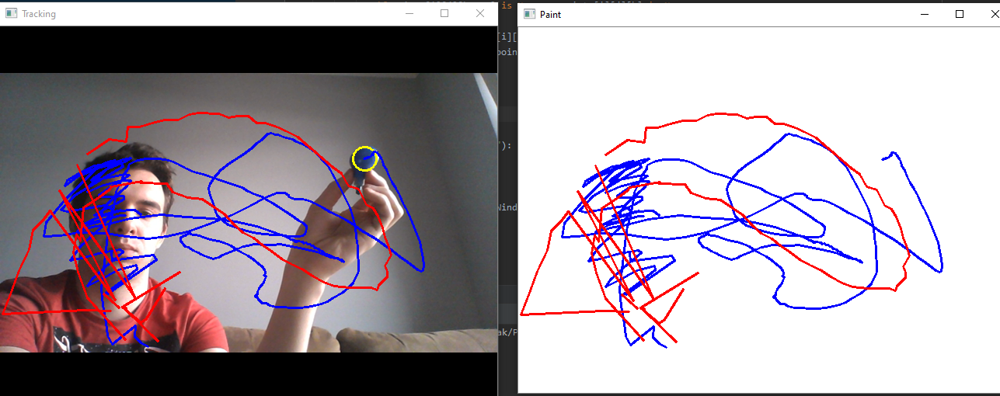

# Projekt PT - rysowanie za pomocą detekcji ruchu w kamerze

## Instrukcja

Program ukazuje dwa okna (Drawing oraz Tracking). Okno Drawing ukazuje narysowany obraz natomiast Tracking ukazuje detekcję elementów w kamerze.
Za pomoca kalwiatury można dokonać następujących czynności:
- zakmnąć program (q),
- wyczyścić obraz (c),
- zapisać obraz (s).

Program rozpoznaje trzy podstawowe kolory (niebieski, zielony oraz czerowny). Za pomocą kredek/pisaków oraz ruchów dłonią przy włączonej kamerze można stowrzyć rysunek, który widoczny jest w oknie Drawing.

